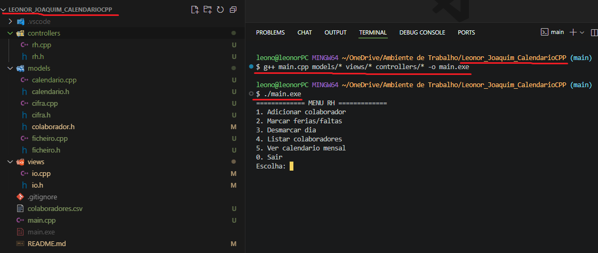
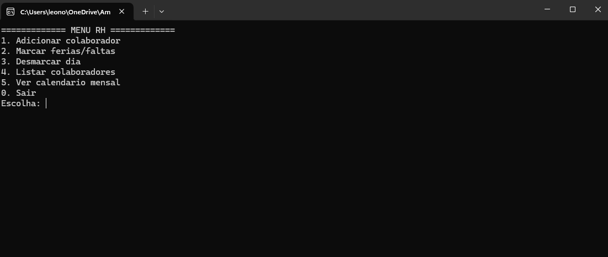

## Contexto
Para a UC 00607 o Professor solicitou a realização de um mini sistema RH que envolvesse os seguintes conceitos:
1. Vectores
2. Leitura e escrita em Ficheiros, no caso escolhi CSV
3. Utilizar cifras para guardar nomes encriptados

## Objetivo do Programa:
1. Adicionar Colaboradores;
2. Marcar e desmarcar férias ou faltas;
   - Não permite fazer marcações ao fim-de-semana
3. Imprime um calendário Mensal
   - **Amarelo** -> Fim de semana
   - **Vermelho** -> Faltas
   - **Verde** -> Férias
4. Utilizar Arquitetura **MVC**

## Validações do Programa:
1. Cálculo de ano Bissexto:
   <pre> bool anoBissexto(int ano){
    return (ano % 4 == 0 && ano % 100 != 0) || (ano % 400 == 0);} </pre>
    - Se for multiplo de 4 é Bissexto. Mas se for multiplo de 4 e 100, já não é bissexto. No entanto, se for multiplo de 400 é bissexto.

2. Proibição de marcar faltas/férias ao fim de semana
   <pre>if (fimDeSemana(d, m, a))
        return; </pre>

3. Evita nomes iguais 
   <pre>for (const auto &c : lista) {
        if (c.nome == nome)
            return;
    } </pre>

## Em relação à utilização de memória dinamicamente
Utilizei std::vector para utilizar memória dinamicamente, para evitar problemas de memory leaks.

## Como correr o programa localmente:
No caso da minha máquina, utilizo o mingw para compilar, pelo que no terminal na mesma pasta onde se encontra o main.cpp corro o seguinte comando: 

`g++ main.cpp views/* models/* controllers/* -o main.exe`

`./main.exe`

Correr o programa no terminal do Vscode


Correr o programa com duplo clique no executável



## Organização do Programa
```
Leonor_Joaquim_CalendarioCPP
├─ colaboradores.csv -- Ficheiro CSV com dados iniciais
├─ controllers --Regras de lógica principal
│  ├─ rh.cpp 
│  └─ rh.h 
├─ main.cpp --Ficheiro que liga o View ao Controller ao Models
├─ models
│  ├─ calendario.cpp --Funções para calcular datas (Congruência de Zeller)
│  ├─ calendario.h 
│  ├─ cifra.cpp --Para encriptação e desincriptação dos nomes 
│  ├─ cifra.h
│  ├─ colaborador.h -- Structs de dados dos funcionários e marcações
│  ├─ ficheiro.cpp -- Para ler, escrever e guardar no CSV
│  └─ ficheiro.h
├─ README.md
└─ views
   ├─ io.cpp --Para imprimir interface para o utilizador
   └─ io.h
```

## Como funciona a encriptação:

A Cifra escolhida foi a [Cifra de César](https://www.geeksforgeeks.org/ethical-hacking/caesar-cipher-in-cryptography/) (por sugestão do Professor) e funciona basicamente movendo no alfabeto o número de letras consoante a chave sugerida. Ou seja, se a chave for 2, a letra A passa a ser C e por aí diante. É uma encriptação mais simples que [XOR com HEX](https://www.geeksforgeeks.org/dsa/xor-encryption-shifting-plaintext/), mas serve o propósito para este projeto. 


## Formato do Ficheiro CSV

`NomeComCifra,AAAA-MM-DD,T`
1. Nome Com Cifra de César
2. Data Escolhida
3. Tipo - Pode ser Férias (F) ou Falta (X)

Caso haja um colaborador sem marcações, no ficheiro CSV vai aparecer apenas o nome seguido de duas virgulas
<pre> if(c.marcacoes.empty()) { 
         f << nomeComCifra << ",,\n"; 
   }</pre>